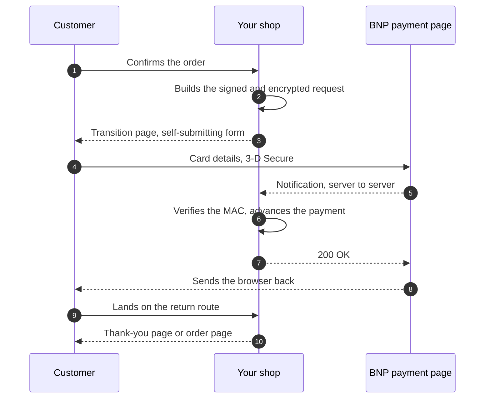

# Sylius Axepta BNP Paribas Plugin

[](LICENSE)
[](https://packagist.org/packages/cyllene-digital/sylius-axepta-plugin)
[](https://github.com/CylleneDigital/SyliusAxeptaPlugin/actions/workflows/build.yaml)
[](https://github.com/CylleneDigital/SyliusAxeptaPlugin/actions/workflows/security.yaml)

Integration of the **Axepta BNP Paribas** payment gateway for **Sylius 2**.

> Axepta® is a registered trademark of BNP Paribas. This plugin is an independent integration,
> neither affiliated with, sponsored by, nor endorsed by BNP Paribas. No BNP Paribas or Axepta logo
> ships with this package.

## Compatibility

| | Versions |
|---|---|
| PHP | `^8.2` |
| Sylius | `^2.1` |
| Symfony | `^6.4` or `^7.4` |

## What this plugin does

Card payment through the **card form hosted** by the bank (`payssl.aspx`): the customer is
redirected, enters their card at BNP, and the shop is notified server-to-server.

> **This plugin implements Axepta BNP Paribas Online 1.0**, the generation with `.aspx` endpoints.
> BNP also offers **Online 2.0**, a REST API with OAuth 2.0 authentication: that is not a version of
> the same protocol but a separate product, and this plugin does not cover it. No end of support for
> 1.0 has been announced to date; check that point with your account manager if you are starting a
> fresh integration.

- Both payment mechanisms of Sylius 2: **Payum** and **PaymentRequest**;
- configuration in the back office, per channel;
- overridable redirect page, usable without JavaScript;
- notifications authenticated by HMAC-SHA256, idempotent.

**You never see a card number.** Payment happens entirely at BNP: your shop stays outside the
PCI-DSS SAQ-D scope - SAQ-A is what applies. That does not relieve you of your own obligations, but
this plugin adds nothing to them.

### The flow



Two properties of that sequence matter more than the rest, and both cost an incident before being
understood:

**Step 5 is what counts, not step 8.** The order turns paid on the notification, never on the
browser coming back. A customer closing their tab right after paying must still see their order
paid. Conversely, a browser coming back proves nothing: it may arrive before the notification, or
never arrive at all.

**Step 7 must be a `200`.** A 404 or a 500 there triggers 8 retries from the bank spread over
~21 h 36. The whole notification handling is built around that: no exception surfaces, an unreadable
message is a non-event, and a double notification - the nominal case at BNP - changes nothing rather
than failing.

## Installation

```bash
composer require cyllene-digital/sylius-axepta-plugin
```

Add the bundle to `config/bundles.php`:

```php
CylleneDigital\SyliusAxeptaPlugin\CylleneDigitalSyliusAxeptaPlugin::class => ['all' => true],
```

The details, including the infrastructure points not to forget:
[`docs/installation.md`](docs/installation.md).

## Configuration

**Configuration → Payment methods → Create**, gateway "Axepta - BNP Paribas". Fill in the merchant
identifier and the two keys supplied by BNP.

⚠️ **There is only one endpoint.** The MID is what determines whether you are in test or in
production - a test MID and a production MID are two distinct identifiers on the same platform. A
configuration mistake sends real transactions to production.

Every setting, the key rotation procedure and its pitfall:
[`docs/configuration.md`](docs/configuration.md).

## Documentation

| | |
|---|---|
| [Installation](docs/installation.md) | Bundle, routes, encryption key, trusted proxies, and the infrastructure points nobody handles unless they are named |
| [Configuration](docs/configuration.md) | Gateway settings, key rotation, logging, customising the redirect page |
| [Payum or PaymentRequest](docs/payum-vs-payment-request.md) | Which path to pick, and why their notification URLs differ |
| [The protocol](docs/protocol.md) | What the plugin sends and accepts, telling what BNP guarantees from what was merely observed |
| [Acceptance testing](docs/testing-with-the-bnp-sandbox.md) | The runbook against the real platform, to walk through before every major version |
| [Versioning and support](docs/versioning.md) | Public API, internals, support policy |

Sylius 2 offers two payment mechanisms and the plugin implements both; the choice is made per
payment method through `usePayum`. **Standard checkout, take Payum. API or headless, take
PaymentRequest.** Both have taken real payments on the BNP test environment.

A flaw is reported privately: [`SECURITY.md`](SECURITY.md). Do not open it as a public issue.

## Status

**Exercised against the real BNP platform**, on both payment paths: accepted payment, refused card
then a fresh attempt, server-to-server notification and signature verification, replayed
notification, accented description in ISO-8859-1, and twelve-character merchant reference. The
nominal cycles were replayed on the code as it stands; the remaining cases come from an earlier
campaign, on a slightly older revision.

**The continuous integration matrix is green** across the eighteen advertised combinations: PHP 8.2
to 8.5, Symfony 6.4 and 7.4, Sylius 2.1 and 2.2, and MySQL 8.4, MariaDB 11.4 and PostgreSQL 17. The
run against the real platform was carried out on **PHP 8.4 / Sylius 2.2 / Symfony 7.4** - the only
combination on which a payment was actually taken.

Sylius **2.0 is not supported**: its cart test context did not restore the security token before
2.1, so the end-to-end scenarios cannot be played there. We would rather not advertise a
compatibility we have no way of exercising.

The scope stops at one-off card payment: refund, cancellation, deferred capture, instalments and
alternative payment means are not part of it, and all of them would need BNP's server-to-server API,
which this plugin never calls.

## Contributing

[`CONTRIBUTING.md`](CONTRIBUTING.md) - bringing up the test stack, standards, what has to pass.

## Provenance and licence

Released under the **MIT** licence - see [`LICENSE`](LICENSE).

The Blowfish implementation follows Bruce Schneier's public algorithm. The protocol follows the
public Axepta BNP Paribas documentation (<https://docs.axepta.bnpparibas>).

---

Package: `cyllene-digital/sylius-axepta-plugin` - Maintainer: Cyllene
